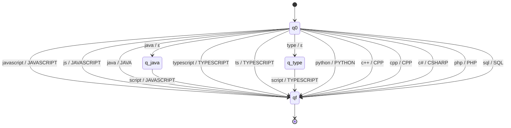
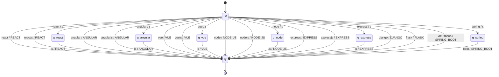
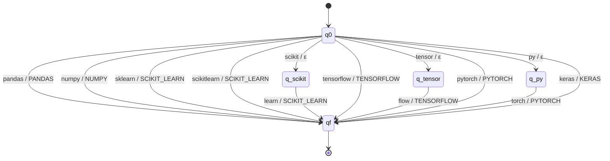
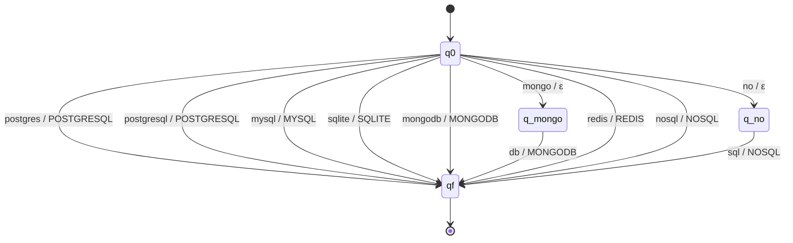
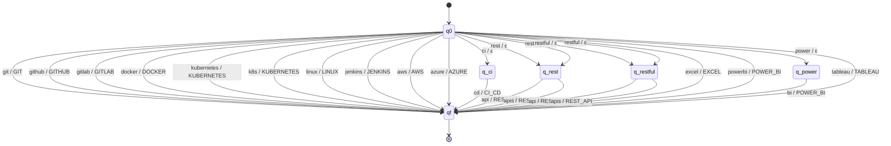
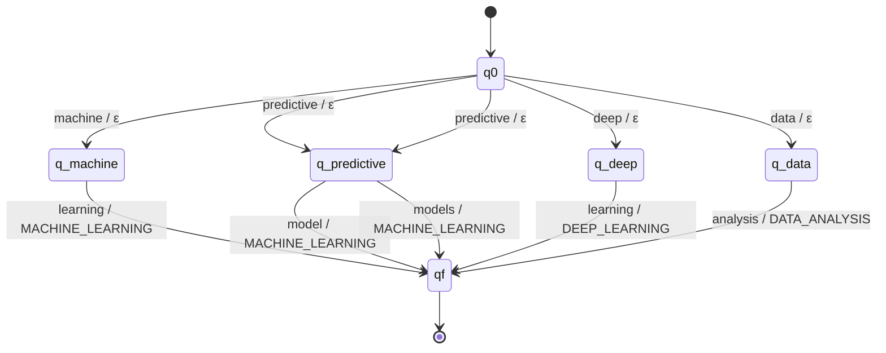

# Stage 2 - Skill Normalization with Finite-State Transducers

Module: `src/normalizer.py` (profiles in `src/profiles.py`)

## Purpose

The same skill can be written in many ways (`JS`, `Javascript`, `Java Script`).
This stage translates every raw skill from Stage 1 into **one canonical name**
(`JAVASCRIPT`). Then the skills are sorted in the canonical order of each profile,
so the result does not depend on the order used in the resume.

## Design decisions

**Alphabet of tokens, not characters.** Before the transducer runs, each raw
skill is split into lowercase tokens with the regex `[\s.\-_/]+`:

| Raw skill | Tokens |
|---|---|
| `React.js` | `react`, `js` |
| `Scikit-learn` | `scikit`, `learn` |
| `Tensor Flow` | `tensor`, `flow` |
| `CI/CD` | `ci`, `cd` |
| `C++` | `c++` |

So the input alphabet Σ is a finite set of words. This keeps the transducers
small and easy to draw, and it is still a finite-state transducer.

**Output on the last token.** Tokens in the middle of a variant write ε
(nothing). The last token writes the canonical name. For example
`tensor / ε` and then `flow / TENSORFLOW`.

**Nondeterminism.** Some variants are a prefix of another one: `java` is a
skill (JAVA) but also the start of `java script` (JAVASCRIPT). From `q0` with
`java` there are two transitions: one to `qf` writing `JAVA` and one to `q_java`
writing ε. Only the path that ends in `qf` after reading all tokens is
accepted, so `java` gives `JAVA` and `java script` gives `JAVASCRIPT`.
pyformlang explores all paths in `translate`.

**One transducer per category.** There are six transducers (languages,
frameworks, libraries, databases, tools, concepts). `normalize_skill` tries
them one by one and returns the first output. If no transducer accepts the
input, the skill is reported as **unknown**.

**Semantic choice.** `predictive model(s)` is mapped to `MACHINE_LEARNING`,
because building predictive models is machine-learning model development.

## General definition

Each transducer is a 7-tuple **T = (Q, Σ, Γ, δ, ω, q0, F)** where:

- **Q**: finite set of states. `q0` is the start, `qf` the only final state and
  `q_<prefix>` are middle states for variants with more than one token.
- **Σ**: input alphabet (lowercase tokens).
- **Γ**: output alphabet (canonical skill names).
- **δ**: Q × Σ → P(Q), transition relation.
- **ω**: Q × Σ × Q → Γ ∪ {ε}, output written on each transition.
- **q0**: initial state.
- **F** = {qf}: accepting states.

A token sequence w is translated to y when there is a path from q0 to qf that
reads w and writes y.

## Transducers

### T1 - Programming languages (`languages`)

T1 = (Q, Σ, Γ, δ, ω, q0, F)

- **Q** = {q0, q_java, q_type, qf}
- **Σ** = {c#, c++, cpp, java, javascript, js, php, python, script, sql, ts, type, typescript}
- **Γ** = {CPP, CSHARP, JAVA, JAVASCRIPT, PHP, PYTHON, SQL, TYPESCRIPT}
- **q0** = q0
- **F** = {qf}
- **δ** and **ω**:

| From | Input (Σ) | To (δ) | Output (ω) |
|---|---|---|---|
| q0 | `c#` | qf | CSHARP |
| q0 | `c++` | qf | CPP |
| q0 | `cpp` | qf | CPP |
| q0 | `java` | q_java | ε |
| q0 | `java` | qf | JAVA |
| q0 | `javascript` | qf | JAVASCRIPT |
| q0 | `js` | qf | JAVASCRIPT |
| q0 | `php` | qf | PHP |
| q0 | `python` | qf | PYTHON |
| q0 | `sql` | qf | SQL |
| q0 | `ts` | qf | TYPESCRIPT |
| q0 | `type` | q_type | ε |
| q0 | `typescript` | qf | TYPESCRIPT |
| q_java | `script` | qf | JAVASCRIPT |
| q_type | `script` | qf | TYPESCRIPT |

Diagram:



### T2 - Frameworks (`frameworks`)

T2 = (Q, Σ, Γ, δ, ω, q0, F)

- **Q** = {q0, q_angular, q_express, q_node, q_react, q_spring, q_vue, qf}
- **Σ** = {angular, angularjs, boot, django, express, expressjs, flask, js, node, nodejs, react, reactjs, spring, springboot, vue, vuejs}
- **Γ** = {ANGULAR, DJANGO, EXPRESS, FLASK, NODE_JS, REACT, SPRING_BOOT, VUE}
- **q0** = q0
- **F** = {qf}
- **δ** and **ω**:

| From | Input (Σ) | To (δ) | Output (ω) |
|---|---|---|---|
| q0 | `angular` | q_angular | ε |
| q0 | `angular` | qf | ANGULAR |
| q0 | `angularjs` | qf | ANGULAR |
| q0 | `django` | qf | DJANGO |
| q0 | `express` | q_express | ε |
| q0 | `express` | qf | EXPRESS |
| q0 | `expressjs` | qf | EXPRESS |
| q0 | `flask` | qf | FLASK |
| q0 | `node` | q_node | ε |
| q0 | `node` | qf | NODE_JS |
| q0 | `nodejs` | qf | NODE_JS |
| q0 | `react` | q_react | ε |
| q0 | `react` | qf | REACT |
| q0 | `reactjs` | qf | REACT |
| q0 | `spring` | q_spring | ε |
| q0 | `springboot` | qf | SPRING_BOOT |
| q0 | `vue` | q_vue | ε |
| q0 | `vue` | qf | VUE |
| q0 | `vuejs` | qf | VUE |
| q_angular | `js` | qf | ANGULAR |
| q_express | `js` | qf | EXPRESS |
| q_node | `js` | qf | NODE_JS |
| q_react | `js` | qf | REACT |
| q_spring | `boot` | qf | SPRING_BOOT |
| q_vue | `js` | qf | VUE |

Diagram:



### T3 - Libraries (`libraries`)

T3 = (Q, Σ, Γ, δ, ω, q0, F)

- **Q** = {q0, q_py, q_scikit, q_tensor, qf}
- **Σ** = {flow, keras, learn, numpy, pandas, py, pytorch, scikit, scikitlearn, sklearn, tensor, tensorflow, torch}
- **Γ** = {KERAS, NUMPY, PANDAS, PYTORCH, SCIKIT_LEARN, TENSORFLOW}
- **q0** = q0
- **F** = {qf}
- **δ** and **ω**:

| From | Input (Σ) | To (δ) | Output (ω) |
|---|---|---|---|
| q0 | `keras` | qf | KERAS |
| q0 | `numpy` | qf | NUMPY |
| q0 | `pandas` | qf | PANDAS |
| q0 | `py` | q_py | ε |
| q0 | `pytorch` | qf | PYTORCH |
| q0 | `scikit` | q_scikit | ε |
| q0 | `scikitlearn` | qf | SCIKIT_LEARN |
| q0 | `sklearn` | qf | SCIKIT_LEARN |
| q0 | `tensor` | q_tensor | ε |
| q0 | `tensorflow` | qf | TENSORFLOW |
| q_py | `torch` | qf | PYTORCH |
| q_scikit | `learn` | qf | SCIKIT_LEARN |
| q_tensor | `flow` | qf | TENSORFLOW |

Diagram:



### T4 - Databases (`databases`)

T4 = (Q, Σ, Γ, δ, ω, q0, F)

- **Q** = {q0, q_mongo, q_no, qf}
- **Σ** = {db, mongo, mongodb, mysql, no, nosql, postgres, postgresql, redis, sql, sqlite}
- **Γ** = {MONGODB, MYSQL, NOSQL, POSTGRESQL, REDIS, SQLITE}
- **q0** = q0
- **F** = {qf}
- **δ** and **ω**:

| From | Input (Σ) | To (δ) | Output (ω) |
|---|---|---|---|
| q0 | `mongo` | q_mongo | ε |
| q0 | `mongodb` | qf | MONGODB |
| q0 | `mysql` | qf | MYSQL |
| q0 | `no` | q_no | ε |
| q0 | `nosql` | qf | NOSQL |
| q0 | `postgres` | qf | POSTGRESQL |
| q0 | `postgresql` | qf | POSTGRESQL |
| q0 | `redis` | qf | REDIS |
| q0 | `sqlite` | qf | SQLITE |
| q_mongo | `db` | qf | MONGODB |
| q_no | `sql` | qf | NOSQL |

Diagram:



### T5 - Tools (`tools`)

T5 = (Q, Σ, Γ, δ, ω, q0, F)

- **Q** = {q0, q_ci, q_power, q_rest, q_restful, qf}
- **Σ** = {api, apis, aws, azure, bi, cd, ci, docker, excel, git, github, gitlab, jenkins, k8s, kubernetes, linux, power, powerbi, rest, restful, tableau}
- **Γ** = {AWS, AZURE, CI_CD, DOCKER, EXCEL, GIT, GITHUB, GITLAB, JENKINS, KUBERNETES, LINUX, POWER_BI, REST_API, TABLEAU}
- **q0** = q0
- **F** = {qf}
- **δ** and **ω**:

| From | Input (Σ) | To (δ) | Output (ω) |
|---|---|---|---|
| q0 | `aws` | qf | AWS |
| q0 | `azure` | qf | AZURE |
| q0 | `ci` | q_ci | ε |
| q0 | `docker` | qf | DOCKER |
| q0 | `excel` | qf | EXCEL |
| q0 | `git` | qf | GIT |
| q0 | `github` | qf | GITHUB |
| q0 | `gitlab` | qf | GITLAB |
| q0 | `jenkins` | qf | JENKINS |
| q0 | `k8s` | qf | KUBERNETES |
| q0 | `kubernetes` | qf | KUBERNETES |
| q0 | `linux` | qf | LINUX |
| q0 | `power` | q_power | ε |
| q0 | `powerbi` | qf | POWER_BI |
| q0 | `rest` | q_rest | ε |
| q0 | `rest` | q_rest | ε |
| q0 | `restful` | q_restful | ε |
| q0 | `restful` | q_restful | ε |
| q0 | `tableau` | qf | TABLEAU |
| q_ci | `cd` | qf | CI_CD |
| q_power | `bi` | qf | POWER_BI |
| q_rest | `api` | qf | REST_API |
| q_rest | `apis` | qf | REST_API |
| q_restful | `api` | qf | REST_API |
| q_restful | `apis` | qf | REST_API |

Diagram:



### T6 - Concepts (`concepts`)

T6 = (Q, Σ, Γ, δ, ω, q0, F)

- **Q** = {q0, q_data, q_deep, q_machine, q_predictive, qf}
- **Σ** = {analysis, data, deep, learning, machine, model, models, predictive}
- **Γ** = {DATA_ANALYSIS, DEEP_LEARNING, MACHINE_LEARNING}
- **q0** = q0
- **F** = {qf}
- **δ** and **ω**:

| From | Input (Σ) | To (δ) | Output (ω) |
|---|---|---|---|
| q0 | `data` | q_data | ε |
| q0 | `deep` | q_deep | ε |
| q0 | `machine` | q_machine | ε |
| q0 | `predictive` | q_predictive | ε |
| q0 | `predictive` | q_predictive | ε |
| q_data | `analysis` | qf | DATA_ANALYSIS |
| q_deep | `learning` | qf | DEEP_LEARNING |
| q_machine | `learning` | qf | MACHINE_LEARNING |
| q_predictive | `model` | qf | MACHINE_LEARNING |
| q_predictive | `models` | qf | MACHINE_LEARNING |

Diagram:



## Sorting by profile

After normalization, `sort_for_profile(skills, profile)` keeps only the skills
that belong to the profile and orders them by the groups defined in
`src/profiles.py`:

| Profile | Canonical order of groups |
|---|---|
| FULL_STACK_DEVELOPER | Language → Frontend → Backend → Database → API → Version control |
| MACHINE_LEARNING_ENGINEER | Language → Data libraries → ML libraries → ML concepts → Database → Version control |
| DEVOPS_ENGINEER | Scripting → Operating system → Containers → CI/CD → Cloud → Version control |
| DATA_ANALYST | Query language → Programming → Data libraries → BI tools → Analysis → Database |

Example:

```
input (Stage 1):   Git, NodeJS, JS, Postgres, React.js
normalized:        GIT, NODE_JS, JAVASCRIPT, POSTGRESQL, REACT
sorted full stack: JAVASCRIPT, REACT, NODE_JS, POSTGRESQL, GIT
```

The sorted sequence is the input word for the automata of Stage 3.

## Limitations

- Only the variants listed in `RULES` are recognized; new spellings must be added.
- Spelling mistakes (`Javscript`) are not corrected.
- A skill is mapped only by its name, not by its context in the resume.
