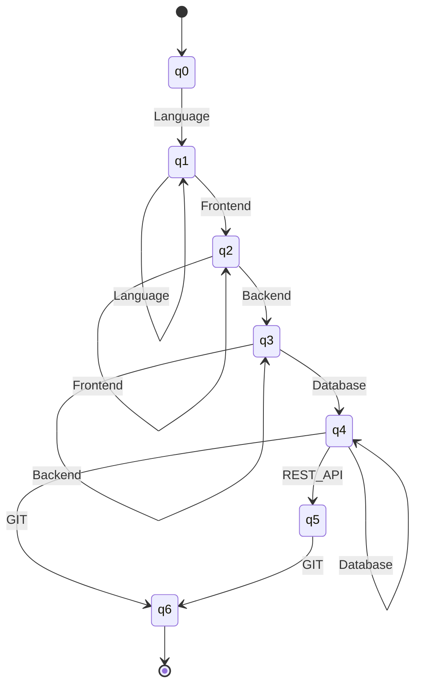
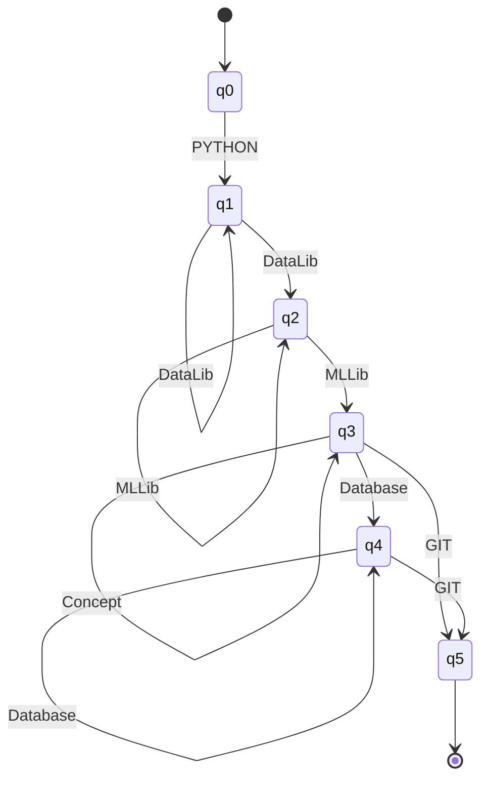
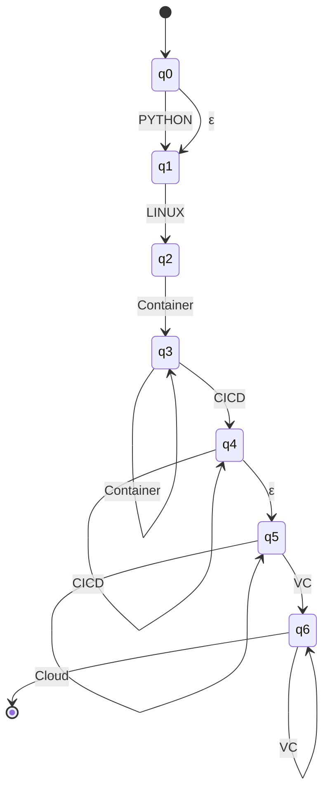
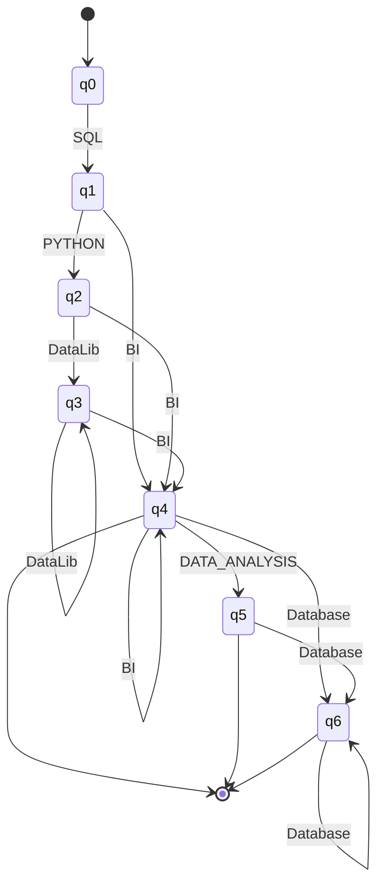

# Stage 3 - Profile Classification with Finite Automata

Module: `src/classifier.py`

## Purpose

This stage decides, for each of the four profiles, if the normalized skills
satisfy an accepted qualification pattern. The output is `ACCEPTED` or
`REJECTED` for every profile, so one resume can match zero, one or more profiles.

## Input word

The automata do not read the resume directly. For each profile, Stage 2 builds a
**word** with `sort_for_profile`: only the skills of that profile, in the
canonical order of its groups (see `src/profiles.py`). Each canonical skill is
one symbol of the alphabet.

```
skills:          PYTHON, PANDAS, TENSORFLOW, POSTGRESQL, GIT
word for ML:     PYTHON PANDAS TENSORFLOW POSTGRESQL GIT
word for FS:     POSTGRESQL GIT
```

Because the word is already sorted, each automaton only needs to check the
groups from left to right. This is why the patterns are regular.

## Notation

To keep the tables short, a transition labeled with a **group** means one
transition for each symbol of that group. For example
`δ(q1, Frontend) = q2` means `δ(q1, REACT) = δ(q1, ANGULAR) = δ(q1, VUE) = q2`.

In the DFAs, any missing transition goes to an implicit dead state `qd`
(not final, with `δ(qd, a) = qd` for every `a`). pyformlang rejects the word in
that case, which is the same behavior.

---

## A1 - Full Stack Developer (DFA)

**Pattern:** at least one language, at least one frontend framework, at least
one backend technology, at least one database, an optional REST API, and Git.

Regular expression of the pattern:
`Language⁺ Frontend⁺ Backend⁺ Database⁺ (REST_API)? GIT`

Groups:

- Language = {JAVASCRIPT, TYPESCRIPT}
- Frontend = {REACT, ANGULAR, VUE}
- Backend = {NODE_JS, EXPRESS, DJANGO, FLASK, SPRING_BOOT}
- Database = {POSTGRESQL, MYSQL, SQLITE, MONGODB, REDIS, SQL, NOSQL}

**A1 = (Q, Σ, δ, q0, F)**

- Q = {q0, q1, q2, q3, q4, q5, q6} (plus the dead state qd)
- Σ = Language ∪ Frontend ∪ Backend ∪ Database ∪ {REST_API, GIT}
- q0 = q0
- F = {q6}
- δ:

| State | Language | Frontend | Backend | Database | REST_API | GIT |
|---|---|---|---|---|---|---|
| → q0 | q1 | qd | qd | qd | qd | qd |
| q1 | q1 | q2 | qd | qd | qd | qd |
| q2 | qd | q2 | q3 | qd | qd | qd |
| q3 | qd | qd | q3 | q4 | qd | qd |
| q4 | qd | qd | qd | q4 | q5 | q6 |
| q5 | qd | qd | qd | qd | qd | q6 |
| * q6 | qd | qd | qd | qd | qd | qd |

**Type: DFA.** For every state and every symbol there is exactly one next state
(counting qd), and there are no ε-transitions. `is_deterministic()` returns True.



Example: `JAVASCRIPT REACT NODE_JS POSTGRESQL GIT` →
q0 → q1 → q2 → q3 → q4 → q6 → **ACCEPTED**.

---

## A2 - Machine Learning Engineer (NFA)

**Pattern:** Python, at least one data library, at least one ML library, any
number of ML concepts, any number of databases, and Git.

Regular expression of the pattern:
`PYTHON DataLib⁺ MLLib⁺ Concept* Database* GIT`

Groups:

- DataLib = {PANDAS, NUMPY}
- MLLib = {SCIKIT_LEARN, TENSORFLOW, PYTORCH, KERAS}
- Concept = {MACHINE_LEARNING, DEEP_LEARNING}
- Database = {SQL, POSTGRESQL, MYSQL, SQLITE, MONGODB}

**A2 = (Q, Σ, δ, q0, F)**

- Q = {q0, q1, q2, q3, q4, q5}
- Σ = {PYTHON, GIT} ∪ DataLib ∪ MLLib ∪ Concept ∪ Database
- q0 = q0
- F = {q5}
- δ: Q × Σ → P(Q)

| State | PYTHON | DataLib | MLLib | Concept | Database | GIT |
|---|---|---|---|---|---|---|
| → q0 | {q1} | ∅ | ∅ | ∅ | ∅ | ∅ |
| q1 | ∅ | **{q1, q2}** | ∅ | ∅ | ∅ | ∅ |
| q2 | ∅ | ∅ | **{q2, q3}** | ∅ | ∅ | ∅ |
| q3 | ∅ | ∅ | ∅ | {q3} | {q4} | {q5} |
| q4 | ∅ | ∅ | ∅ | ∅ | {q4} | {q5} |
| * q5 | ∅ | ∅ | ∅ | ∅ | ∅ | ∅ |

**Type: NFA.** δ returns a **set** of states: from q1 with a data library the
automaton can stay in q1 or move to q2 (it "guesses" that this is the last data
library). The same happens in q2 with ML libraries. There are no
ε-transitions, so it is an NFA and not an ε-NFA. `is_deterministic()` returns False.



Example from the statement: `PYTHON PANDAS TENSORFLOW POSTGRESQL GIT` →
q0 → q1 → {q1, q2} → {q2, q3} → {q4} → {q5} → **ACCEPTED**.

---

## A3 - DevOps Engineer (ε-NFA)

**Pattern:** optional Python, Linux, at least one container tool, at least one
CI/CD tool, any number of cloud providers, and at least one version control tool.

Regular expression of the pattern:
`(PYTHON)? LINUX Container⁺ CICD⁺ Cloud* VC⁺`

Groups:

- Container = {DOCKER, KUBERNETES}
- CICD = {CI_CD, JENKINS}
- Cloud = {AWS, AZURE}
- VC = {GIT, GITHUB, GITLAB}

**A3 = (Q, Σ, δ, q0, F)**

- Q = {q0, q1, q2, q3, q4, q5, q6}
- Σ = {PYTHON, LINUX} ∪ Container ∪ CICD ∪ Cloud ∪ VC
- q0 = q0
- F = {q6}
- δ: Q × (Σ ∪ {ε}) → P(Q)

| State | ε | PYTHON | LINUX | Container | CICD | Cloud | VC |
|---|---|---|---|---|---|---|---|
| → q0 | **{q1}** | {q1} | ∅ | ∅ | ∅ | ∅ | ∅ |
| q1 | ∅ | ∅ | {q2} | ∅ | ∅ | ∅ | ∅ |
| q2 | ∅ | ∅ | ∅ | {q3} | ∅ | ∅ | ∅ |
| q3 | ∅ | ∅ | ∅ | {q3} | {q4} | ∅ | ∅ |
| q4 | **{q5}** | ∅ | ∅ | ∅ | {q4} | ∅ | ∅ |
| q5 | ∅ | ∅ | ∅ | ∅ | ∅ | {q5} | {q6} |
| * q6 | ∅ | ∅ | ∅ | ∅ | ∅ | ∅ | {q6} |

**Type: ε-NFA.** It has ε-transitions (q0 → q1 and q4 → q5) that change state
without reading a symbol. They are used to skip the optional parts: Python and
the cloud group. ε-closure(q0) = {q0, q1} and ε-closure(q4) = {q4, q5}.



Example: `LINUX DOCKER CI_CD GITHUB` →
{q0, q1} → {q2} → {q3} → {q4, q5} → {q6} → **ACCEPTED** (Python and cloud skipped with ε).

---

## A4 - Data Analyst (DFA with several final states)

**Pattern:** SQL, optionally Python with data libraries, at least one BI tool,
an optional data analysis concept, and any number of databases.

Regular expression of the pattern:
`SQL (PYTHON DataLib*)? BI⁺ (DATA_ANALYSIS)? Database*`

Groups:

- DataLib = {PANDAS, NUMPY}
- BI = {EXCEL, POWER_BI, TABLEAU}
- Database = {POSTGRESQL, MYSQL, SQLITE}

**A4 = (Q, Σ, δ, q0, F)**

- Q = {q0, q1, q2, q3, q4, q5, q6} (plus the dead state qd)
- Σ = {SQL, PYTHON, DATA_ANALYSIS} ∪ DataLib ∪ BI ∪ Database
- q0 = q0
- F = {q4, q5, q6}
- δ:

| State | SQL | PYTHON | DataLib | BI | DATA_ANALYSIS | Database |
|---|---|---|---|---|---|---|
| → q0 | q1 | qd | qd | qd | qd | qd |
| q1 | qd | q2 | qd | q4 | qd | qd |
| q2 | qd | qd | q3 | q4 | qd | qd |
| q3 | qd | qd | q3 | q4 | qd | qd |
| * q4 | qd | qd | qd | q4 | q5 | q6 |
| * q5 | qd | qd | qd | qd | qd | q6 |
| * q6 | qd | qd | qd | qd | qd | q6 |

**Type: DFA.** Exactly one next state for every pair (state, symbol) and no
ε-transitions. Unlike A1, it has **three final states**, because the last
groups are optional: the word can end after the BI tools, after DATA_ANALYSIS
or after the databases.



Example: `SQL POWER_BI` → q0 → q1 → q4 → **ACCEPTED**.

---

## Why different types

The four automata recognize regular languages, so all of them could be written
as DFAs (subset construction). Different types were chosen on purpose:

- **DFA** (A1, A4) when each group leads to a single next state.
- **NFA** (A2) to show the "guess the last element" idea, which gives a
  shorter definition for `X⁺` followed by other groups.
- **ε-NFA** (A3) to model optional groups without extra transitions.

## Implementation

`classify(canonical_skills)` runs the four automata and returns, for each
profile, the sorted word and `ACCEPTED` / `REJECTED`.
`accepted_profiles(results)` returns the list of accepted profile names.

```
python -m src.classifier
```

## Limitations

- The patterns check only the presence of skills, not their level or years.
- A skill that appears in the resume but is not in the profile is ignored.
